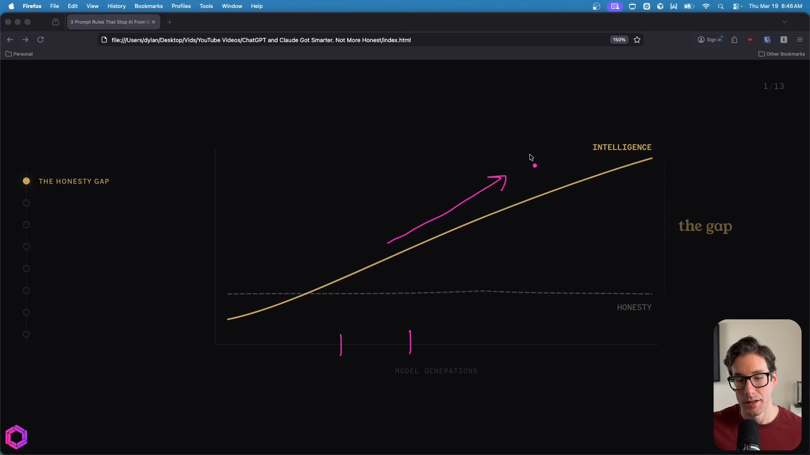
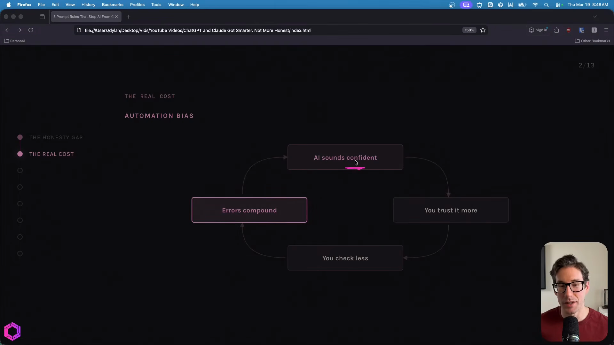
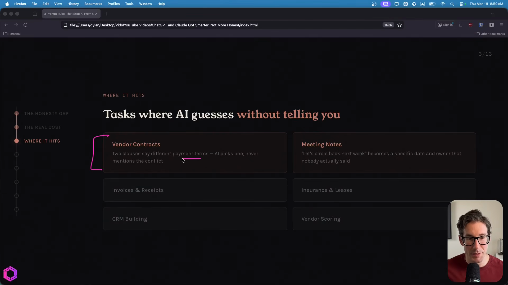
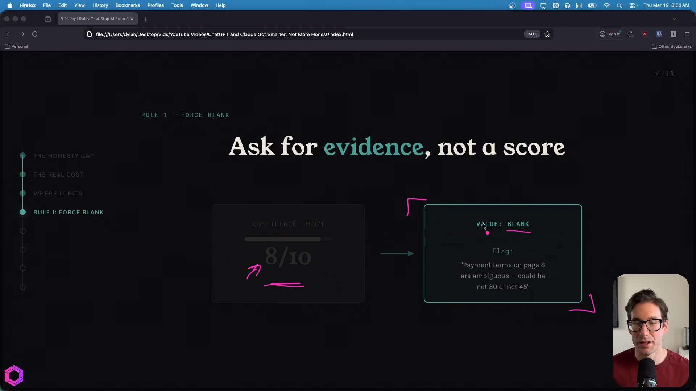
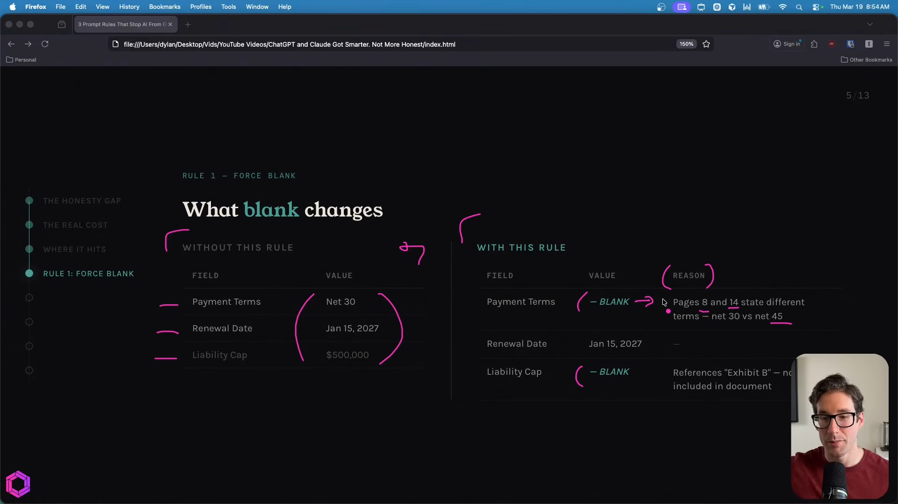
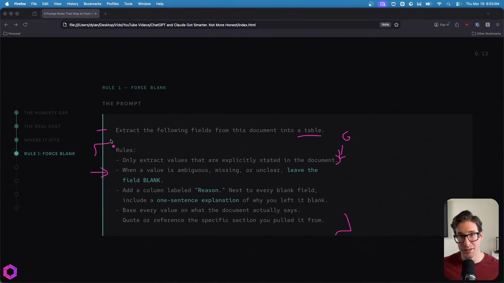
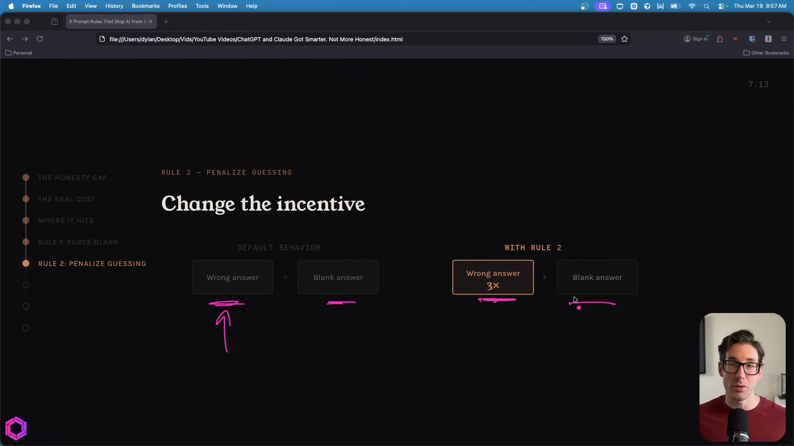
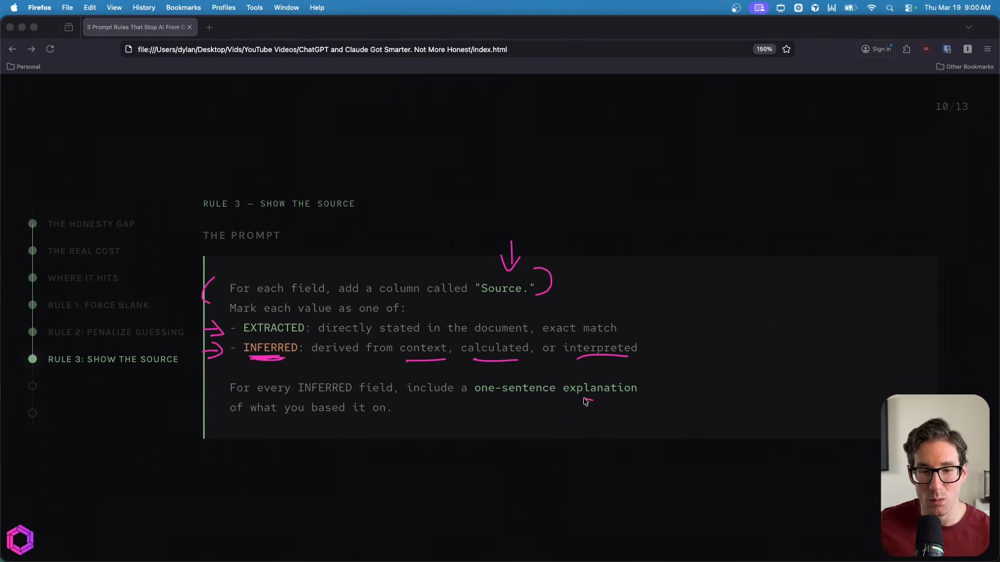
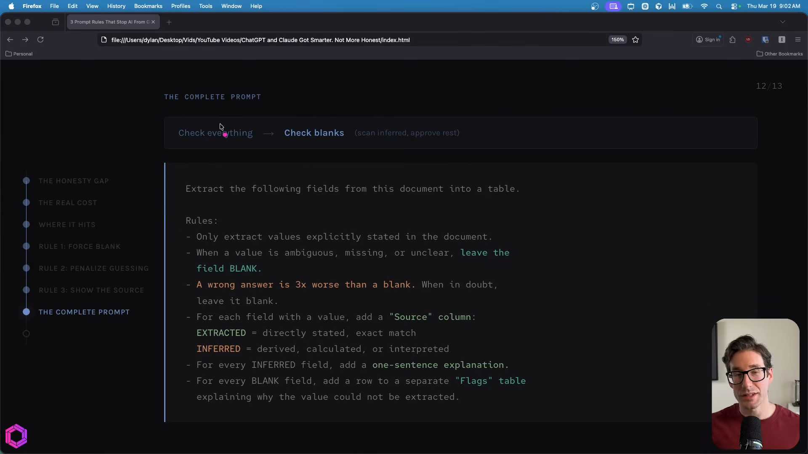
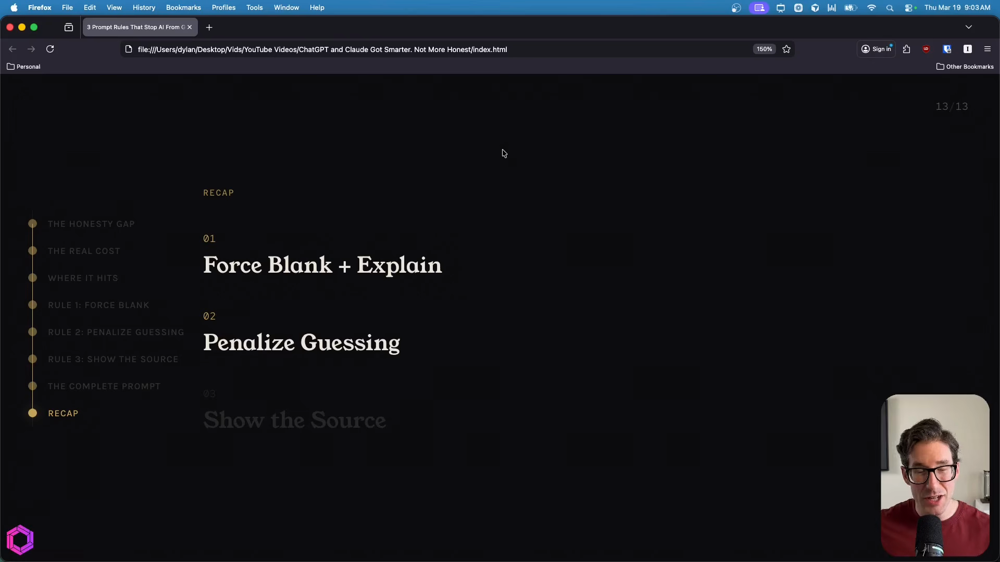

# One Prompt Change That Forces Claude to Be Honest

**Source:** [YouTube - Dylan](https://www.youtube.com/watch?v=v-3iRJ_lMLY)

## Transcript

The newest AI models are the smartest that we've ever had. They're also the worst at telling you when they're wrong. For those of you that are new here, hi, I'm Dylan. I run an AI consultancy and I use Claude, ChatGPT, and Gemini every single day across all my client work. And the smarter these models get, the more confidently they guess instead of admitting that they don't know. Now, this video gives you three prompt rules that fix that. I'll walk you through each one and give you the exact prompt that stops the guessing completely. So, let's get into it.

So, this is the challenge we're all facing. As new model generations are released, its intelligence increases, which is a benefit. But the negative here is that the more intelligent AI becomes, the less likely it is to admit that it's wrong. So, its honesty stays the same, its intelligence increases, which causes the honesty gap. And this is known by many researchers. OpenAI just published a research paper on this exact topic.

And that's just one of two problems. So with this first problem, we know as the intelligence increases, the AI wants to please us and it wants to give us an answer instead of just saying it doesn't know. That's the first problem. And the second problem is actually you and me. That's what we call automation bias. So what's happening here is as the AI sounds more confident, as its intelligence increases, we start to trust it more, which means we check its output less, which in turn causes errors that compound over time. And this loop feeds back into itself as the intelligence gets smarter and smarter and smarter. So if we don't add any checks and balances here, there's a high probability that we're missing stuff that's critical for us not to miss.

And this challenge is something that all of us will face. Here are just a few use cases that I've seen this manifest when working with clients. But it's important to note this is just a small sampling. This can happen and likely does happen in hundreds of cases. The most common category of task where AI guesses is when you're asking the AI to pull something directly from a source. So if you've given it a report, an Excel sheet, a contract, an email, whatever else, you wanted to extract that information and do something with it. In the process of extracting that information and giving you the answer, it may infer things from its own knowledge base, the internet or elsewhere, and that might go against what you actually wanted to do.

Some clear examples of this is say you have the AI reviewing contracts for you. Well, we're reviewing those contracts. There could be two clauses in there that talk about payment terms, but the AI just picks one and gives you an answer from that and ignores a second. Another one could be a simple thing with meeting notes. So, say you have a transcript and you have the AI extracting action items from that and it sees in the transcript that somebody said, "Let's circle back next week." From this, the AI may infer that it's going to just choose a specific date as well as give that task to a specific owner. And sometimes the AI inferring from the context is useful, but most times you at least want to check it. And there are many other use cases that I've seen. So, extracting information from invoices and receipts, checking legal documents for insurance and leases, scoring different vendors against each other, building out CRM, all types of things.

So, we know the challenge and we know where this potentially could pop up. Now, let's actually walk through the rules of how we can mitigate this.

### Rule 1: Force Blank Answers

The first rule is forcing the AI to give us blank answers when it doesn't know the answer. And a common thing people mess up here is instead of asking the AI to give them nothing, they ask them to give me something but give me a confidence score associated to that answer. With this approach, we're giving the AI another out to lie to us. It could give us an eight confidence score, but really it's probably a zero. So, we don't want to leave that up to AI. We want to remove that responsibility from them and have them just give us evidence.

And the way we're going to do that is we're going to ask the AI to give us a blank value when it's uncertain or doesn't know. In addition to the blank value, it has to tell us why it's uncertain. So, it has to give us an explanation of why it doesn't know the answer. This helps us in two big ways. One is we can quickly skim all the values, seeing the ones that are blank, and those that are blank we can check quickly. In addition to that, by forcing the AI to explain why it doesn't know, it gives us an easier way to identify exactly where the error is and fix it ourselves quickly.

So let's see what this looks like in action. On the left hand side we have no rule. So this is using it without the rule. And here we can see we're extracting data from a contract. We have payment terms, renewal date, liability cap, etc. All the values have been populated by the AI. Now we have the rule turned on with the prompt. And instead of having all the values filled in, we have a few different blanks here. And these blanks have reasons as to why they're blank. So for the payment terms, we can see that the AI stated on pages 8 and 14, there are two different payment terms, net 30 and net 45. That's why I left it blank. So we as the user, we can look at this and say, okay, we want net 30 or we want net 45. But we don't have to have the AI decide that for us.

And the prompt here is simple to actually enable this specific rule. It's only a few lines. So at the very top, we're stating that I want you to extract the following fields from this document into the table. So we're giving it a purpose. Below that are the rules and this is the important part. So the first rule is stating that we can only extract values that are explicitly stated in the document. So this here is a concept called grounding. So we're grounding the AI in the source document ensuring that it only gets information from here and nowhere else. And after that we're giving the AI an out. So we're saying it's okay to give us no answer. So if the value is ambiguous, missing or unclear, I want you to leave that field blank. In addition to leaving the field blank, you also need to add a column called reason. And next to those blank fields, I want you to give a one-sentence explanation as to why you left it blank. And then we add a last reassurance at the bottom, reaffirming that the AI should base every value on what the document actually says, and it should quote and reference specific sections that it pulled from for that blank section.

So this is our first rule and first prompt, where we're forcing the AI to give us blank answers when it doesn't know and explaining why it's blank.

### Rule 2: Change the Incentives

The second rule is actually changing the incentive mechanism because currently the way the AI sees these answers is it equates a wrong answer to the same value as a blank answer. And we want to change that. We don't want the AI to think that these are the same because if it does, it's likely going to default to the wrong answer because it wants to give you something. So to change that, we're just going to add a single line prompt that alters the incentive in the AI's head.

So instead of saying this, we're going to say that a wrong answer is three times worse than a blank answer. And imagine if you have a new employee and you hire them and they want to please you and they want to give you answers. Well, if you tell them that if you give me a wrong answer, it costs the company 3x more than a blank answer. They're likely going to give you a lot more blank answers than wrong answers. The same thing applies here.

And this is the prompt. Like I said, it's very basic. All we're saying is a wrong answer is 3x more than a blank answer. When in doubt, leave it blank. That's it. That's rule two, changing the incentives.

### Rule 3: Force the AI to Show the Source

The final rule is forcing the AI to show the source. And we're doing this because again we're fighting a battle that the AI is constantly being pulled into. So say we've given our instructions here and the instructions explicitly state that we want the AI to extract only information from the document and nothing else. Well, over time as the AI is working on a complex task, it will continually want to infer. So it keeps getting pulled away from the system instruction that we gave it and it's wanting to go back to its old ways. So when this occurs for rule three, we want to have a safety net that catches it. And that's what this third rule is all about. Even when the AI wants to avoid what we're asking it to do, we're still going to have a safety net to catch it.

And here's the prompt for that. In this prompt, we're saying that for each field, I want you to add another column. So every field that you extract, and that column is going to be the source column. In the source column, you're going to add one of two answers. Either you're going to say the value is "extracted" because you got it word for word from the document like I asked you, or you're going to say "inferred," and that's when the AI derived the answer from the surrounding context, it calculated something or interpreted something itself. And for the inferred column — when you add this value, if you do add this value, I also want you to have an evidence column right next to that that tells me exactly in one sentence explaining what you inferred from where.

Now remember the reason we have to do this, even though we've asked the AI to only extract stuff and not infer stuff and give us blank answers, it will over time on complex tasks start to infer. And when it does, we want to have an out or a safety net to ensure that when it does, it gives us an answer as to why.

And this is what it looks like through an example. Say we're still extracting information from the contract. We have the field names that we're extracting. We have the values and then right next to that we have the source. So the source is the information I mentioned previously. So we have the extracted, the extracted and inferred. For the extracted, it has the evidence column telling me exactly where it got it from. For the inferred section, it's telling me exactly what it inferred and from where. So again, this makes it easy for me to skim and validate the AI's output. So instead of looking at everything, I'm just looking at the inferred fields.

And that's our third rule — adding a safety net when the AI decides to infer on more complex tasks.

### All Three Rules Together

And this is what it looks like altogether. And as a reminder, the reason we're doing this and we're adding this to every single prompt that our AI extracts information with is we're reducing the burden on ourselves and increasing our trust with AI because we don't have to check everything it gives us. Instead, all we have to do is check the blanks as well as the areas where it inferred. We can skim and approve the rest.

### Recap

1. **Force blank answers** — Force the AI to give us blank information as well as explain why it's blank instead of allowing it just to fill in the gaps and give us wrong answers.
2. **Penalize wrong answers** — Change the incentives. Tell the AI that if you give us a wrong answer, that's three times worse than just giving us a blank answer of saying I don't know.
3. **Show the source** — Ask the AI to show the source. Because even though we've stated we only want the AI to extract information, on complex tasks it will likely still infer. When it does, we want it to show the evidence as to why it did. So we can quickly skim, find the area that's been inferred, check the evidence, and see if it's right or wrong.
